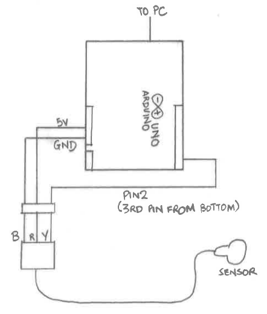

# Goals

In this exercise, we shall try to address the following questions by collecting 
data on ourselves:

1. Does resting heart rate differ according to gender, height and weight?
2. How much is heart rate affected by 
    * watching an exciting sports video?
    * working on a math problem?
3. How long does it take our heart rate to recover after moderate amount of 
physical activity?

As you proceed through this session, think about each step you are doing. The 
following questions may be interesting to ask at each stage:

* Why are we using *this* tool/program?
* What do I expect to see happen?
* What can I conclude from this output? Is the conclusion clear cut? Did I 
overlook any possibilities?

# Setting Up

At any point, if you need help, please raise your hand.

## Downloading What You Need

1. Log in to the PC in front of you. The user name (do not leave out the period and 
the backslash) and password are:
```
username:  .\statuser
password:  4ever!2much4me
```
2. Open up Internet Explorer, and go to this address:
```
http://sta93.stat.nus.edu.sg/stats_camp.zip
```
3. Extract the zipped file on to the Desktop. You should now have a folder 
containing the following items:
    1. hr2b.ino - a file to be loaded onto the Arduino.
    2. data_capture.ipynb - a Python notebook for data capture.
    3. stats_camp.mp4 - a video.
    4. math_problem.pdf - a mathematics problem for you to solve.

## Arduino

1. Make sure that you and your partner have the following items:
    * 1 x Arduino UNO
    * 1 x USB cable
    * 3 x male-to-male jumper cables
    * 1 x Heart rate sensor
2. Connect the Heart-rate sensor to the Arduino according to the diagram below.
The red cable should connect the the 5V power, the black cable to the Ground
pin, and the yellow cable to PIN 2 on the right.

3. Connect the Arduino to one of the USB ports on the PC, and then double-click 
on the `hr2b.ino` program to open the Arduino IDE.
4. Once it is open, go to *Tools > Port* and select the COM port that your Arduino 
Uno is connected to. Write it down (e.g. COM4, or COM5 etc.) somewhere to 
remember it.
5. Click on the Upload button (the arrow pointing to the right) to upload the 
program onto the Arduino. If you any error messages in the console below, alert 
the trainer in your room.
6. Clip the sensor onto the index finger on your non-master hand, and remain
still. Ask your partner to click on the magnifying glass icon on the top right
of the Arduino program. You should see a new window pop up, with a number being
printed continually. An LED on the Arduino should also turn on each time this
happens.


Take a look at the code in the Arduino window. What do you think it is doing?


Is the heart rate sensor working? How would you check?


## Jupyter Notebooks

1. Open Windows Explorer and navigate to the directory where you had extracted 
the zip file.
2. Press Shift and Right-click within this window. A menu should pop-up. One of 
the options should be "Open Powershell here". Click on that.
3. In the terminal that opens, type in 
```
jupyter notebook
```
4. A browser tab should open, with the contents of the directory shown. Click on
the `data_capture.ipynb` file.

What you see now is called a Jupyter notebook. It consists of Python code, 
interspersed with comments and text. The code chunks are referred to as cells.
To run a cell, use the up and down arrow keys to navigate to it, and then hit 
Ctrl-Enter.

5. Run the first two cells now. You will not have to run these again through-out 
the session.
6. Edit the line in the next cell (**Don't run the cell yet!**) to correspond to
the COM port that you noted earlier. For instance, if it was COM5, then the line
should be
```
ser = serial.Serial('COM5')
```

# Data Capture

Every data capture phase consists of the following steps:

1. Edit the file name to correspond to your name and activity. For instance, you
might change it from `testing_output_after_exercise.txt` to `john_baseline.txt`.
Clip the sensor onto your non-master index finger, and then run this cell
(underneath the *Create Connections* heading) to initiate the capture.
2. Run the cell underneath the *Start the capture* heading. This will begin the 
capture process. Each capture will take about 3 minutes; you should see a 
progress bar each time. Try to remain as still as you can at this stage.
3. Run the cell underneath the *Close all connections* heading. This will 
complete one data capture phase. You should see the new file in your directory.
Check that it is not empty. 

Each of you will capture data *FOUR* times:

1. Your baseline heart rate.
2. Your heart rate while watching the sports video in the downloaded folder.
3. Your heart rate while trying to solve a geometry problem. It's ok if you cannot 
solve it; just try your best. If you solve it within 3 minutes, just relax and 
wait for it to finish.
4. Our lab is on the fifth floor. Walk (do not run, please) down the stairs to
the ground floor, then back to the lab and immediately capture your heart rate.

# Uploading

1. In an *new tab* in the browser, navigate to this address:
```
http://sta93.stat.nus.edu.sg:8000/vik/data_upload
```
2. Fill up the entries accurately, select the appropriate activity and hit 
Upload. 
3. The device id can be found on a sticker on the back of the Arduino. Please 
enter it in full, so it should be of the form "Dxx".
4. Please ensure that you input your weight and height consistently. This is 
important in order to match the entries. If you made any incorrect entries, 
please inform one of the trainers.
5. Please upload the files in the activity order listed above, person by person.

# Pause to Think

When you uploaded the baseline file, what do the two entries show? What are the 
blue and red lines? What do you think is the difference between the two plots?
Make a note of your average resting heart rate here.


When you uploaded the video and  math files, what did you observe? Was there a 
difference between this and your resting heart rate?


When you upload the exercise file, try to estimate the time it took to return 
to normal. Write down your recovery time (in seconds) here. 


Is it fair to use your personal guess as your recovery time? If not, how can we
automate this detection? What rule would you use? What is good and what is bad 
about it?
