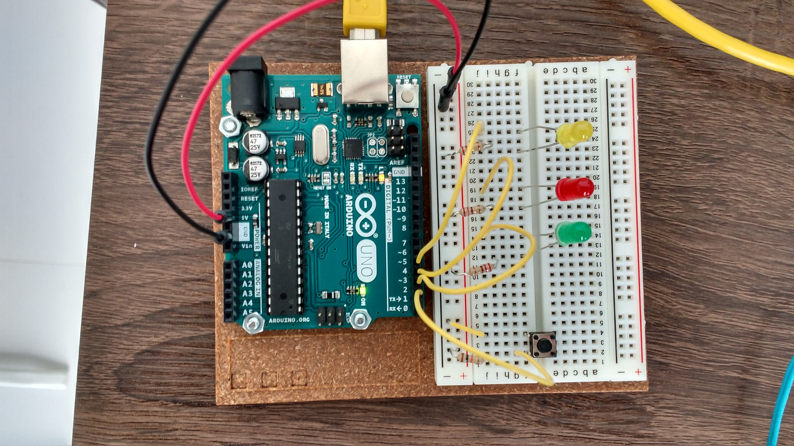

# Introduction

This project was used in a [Statistics Enrichment
Camp](http://www.stat.nus.edu.sg/opencms/events/outreach/camp.html) at NUS in
June 2017. The participants were from various secondary schools and junior
colleges in Singapore.

For my activity, I intended to show them some of the considerations that a
statistician has to make. Here's how the activity went:

1. At the beginning of the day, some students were randomly selected to perform
a mock crime. They were pulled aside from the main group and asked to read
through the following
[document](https://docs.google.com/document/d/1d1GxHHHfoRfWwDv_hTEXks6fbaj7GViHSbQsZgYy9iY/edit?usp=sharing).
Some of them were assigned to the role of **truth-teller** and some to the role
of **liar**.

2. Depending on their role, they were told to go into a room and perform the
crime - either to remove a toy and hide it on their body (liar), or count the
number of toys (truth-teller).

3. During the actual activity, these students were tested using a heart-rate
recorder built using an Arduino. This was the [testing
script](https://docs.google.com/document/d/1wWQ1hxm6_ACLKjNnEA5AtmuVctJOMqtFAFFEIASaKoU/edit?usp=sharing)
that was read to them as part of the test.

4. Here is a
[document](https://docs.google.com/document/d/1GG4-HKs0Lp4WevmfJyn8LojNKCEOp6sCupmX1RNBNcQ/edit?usp=sharing)
that describes what happened. It can be used to brief the students just prior to
the testing.

5. A debriefing was conducted using the following
[slides](what_does_a_statistician_do.pdf).

# Arduino set-up

## Electronic components used

1. Arduino Uno
2. Seeed Grove heart rate sensor
3. 3 x LEDs
4. Jumper cables/leads
5. 4 resistors - 220 Ohm, and 3 110 Ohm resistors
6. 1 push-button switch

The components were connected in the following way:
.

## Software used

1. R and shiny. The data collected was analysed using this [shiny
app](https://panda.stat.nus.edu.sg/stavg/camp2/). You can try it out with this
example [dataset](example.csv). For the smoothing of the heart-rate, the Tukey 
3R smoother was used.
2. The Arduino code is available from my bitbucket account page. My bitbucket id
is **singator**, and the repository name is **stats_camp**. If you cannot find
it, please do not hesitate to email me to get it.

I do hope the students found it interesting :-)
